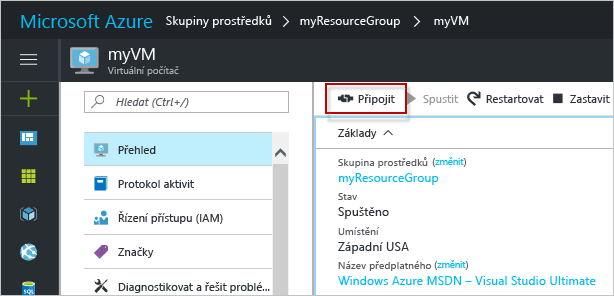

# <a name="create-a-windows-virtual-machine-with-hello-azure-portal"></a>Vytvoření virtuálního počítače s Windows pomocí hello portálu Azure

Virtuální počítače Azure můžete vytvořit prostřednictvím hello portálu Azure. Tato metoda poskytuje uživatelské rozhraní v prohlížeči, pomocí kterého můžete vytvářet a konfigurovat virtuální počítače a všechny související prostředky. Tento postup rychlého spuštění prostřednictvím vytvoření virtuálního počítače a instalaci webovém serveru na hello virtuálních počítačů.

Pokud ještě nemáte předplatné Azure, vytvořte si [bezplatný účet](https://azure.microsoft.com/free/?WT.mc_id=A261C142F) před tím, než začnete.

## <a name="log-in-tooazure"></a>Přihlaste se tooAzure

Přihlaste se toohello portál Azure na http://portal.azure.com.

## <a name="create-virtual-machine"></a>Vytvoření virtuálního počítače

1. Klikněte na tlačítko hello **nový** nalezeno tlačítko na hello levém horním rohu hello portálu Azure.

2. Vyberte **Compute** a potom vyberte **Windows Server 2016 Datacenter**. 

3. Zadejte informace o virtuálním počítači hello. Hello uživatelské jméno a heslo zadané v tomto poli je použité toolog toohello virtuálním počítači. Jakmile budete hotovi, klikněte na **OK**.

      

4. Vyberte velikost hello virtuálních počítačů. Vyberte další velikosti toosee **zobrazit všechny** nebo změňte hello **podporován typ disku** filtru. 

      

5. V okně Nastavení hello, zachovat hello výchozí hodnoty a klikněte na tlačítko **OK**.

6. Na stránce Souhrn hello, klikněte na **Ok** nasazení virtuálního počítače toostart hello.

7. Hello virtuálních počítačů bude definovaného toohello řídicí panel portálu Azure. Po dokončení nasazení hello souhrnu okna hello virtuální počítač se automaticky otevře.


## <a name="connect-toovirtual-machine"></a>Připojte počítač toovirtual

Vytvoření virtuálního počítače toohello připojení ke vzdálené ploše.

1. Klikněte na tlačítko hello **Connect** na vlastnosti virtuálního počítače hello tlačítko. Vytvoří a stáhne se soubor protokolu RDP (Remote Desktop Protocol) – soubor .rdp.

     

2. tooconnect tooyour virtuální počítač, otevřete hello stáhnout soubor RDP. Pokud se zobrazí výzva, klikněte na **Připojit**. V systému Mac, je nutné klientem RDP, jako je tato [klient služby Vzdálená plocha](https://itunes.apple.com/us/app/microsoft-remote-desktop/id715768417?mt=12) z hello Mac App Storu.

3. Zadejte hello uživatelské jméno a heslo, které jste zadali při vytváření hello virtuálního počítače a potom klikněte na tlačítko **Ok**.

4. Může se zobrazit upozornění certifikátu během procesu přihlášení hello. Klikněte na tlačítko **Ano** nebo **pokračovat** tooproceed hello připojení.


## <a name="install-iis-using-powershell"></a>Instalace služby IIS pomocí PowerShellu

Hello virtuálního počítače spusťte relaci prostředí PowerShell a spusťte následující příkaz tooinstall IIS hello.

```powershell
Install-WindowsFeature -name Web-Server -IncludeManagementTools
```

Až budete hotoví, ukončete relaci protokolu RDP hello a vrátí hello vlastnosti virtuálního počítače v hello portálu Azure.

## <a name="open-port-80-for-web-traffic"></a>Otevření portu 80 pro webový provoz 

Skupina zabezpečení sítě (NSG) zabezpečuje příchozí a odchozí provoz. Když virtuální počítač je vytvořen z hello portálu Azure, vytvoří se příchozí pravidlo na portu 3389 pro připojení RDP. Protože tento virtuální počítač hostuje webovém serveru, musí pravidlo NSG toobe vytvořenou pro port 80.

1. Na virtuálním počítači hello, klikněte na název hello hello **skupiny prostředků**.
2. Vyberte hello **skupinu zabezpečení sítě**. Hello NSG lze identifikovat pomocí hello **typ** sloupce. 
3. V levé nabídce hello v části nastavení, klikněte na tlačítko **příchozí pravidla zabezpečení**.
4. Klikněte na **Přidat**.
5. Do pole **Název** zadejte **http**. Zajistěte, aby **rozsah portů** nastavena too80 a **akce** je nastaven příliš**povolit**. 
6. Klikněte na **OK**.


## <a name="view-hello-iis-welcome-page"></a>Zobrazení hello úvodní stránka služby IIS

Pomocí služby IIS nainstalovaná a port 80 otevřete tooyour virtuálních počítačů, webový server hello je nyní přístupná z hello Internetu. Otevřete webový prohlížeč a zadejte hello veřejnou IP adresu hello virtuálních počítačů. Hello veřejnou IP adresu naleznete v okně hello virtuálních počítačů v hello portálu Azure.

 

## <a name="clean-up-resources"></a>Vyčištění prostředků

Pokud již nepotřebujete, odstraňte skupinu prostředků hello, virtuální počítač a všechny související prostředky. toodo Ano, vyberte skupinu prostředků hello v okně hello virtuální počítač a klikněte na tlačítko **odstranit**.

## <a name="next-steps"></a>Další kroky

V tomto Rychlém startu jste nasadili jednoduchý virtuální počítač a pravidlo skupiny zabezpečení sítě a nainstalovali jste webový server. toolearn Další informace o virtuálních počítačích Azure, pokračovat v kurzu toohello pro virtuální počítače Windows.

> [!div class="nextstepaction"]
> [Kurzy pro virtuální počítače Azure s Windows](./tutorial-manage-vm.md)
