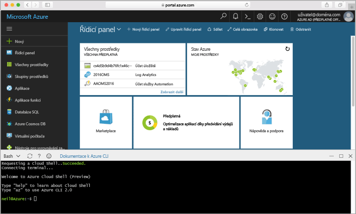

## Spuštění služby Azure Cloud Shell

Hello cloudové prostředí Azure je bezplatná prostředí Bash, který můžete spustit přímo v rámci hello portálu Azure. Má hello rozhraní příkazového řádku Azure předinstalována a nakonfigurované toouse s vaším účtem. Klikněte na tlačítko hello **cloudové prostředí** tlačítko v hello nabídce v pravé horní hello Dobrý den [portál Azure](https://portal.azure.com).

tlačítko Hello spustí interaktivní prostředí, který můžete použít toorun všechny hello kroky v tomto tématu:

