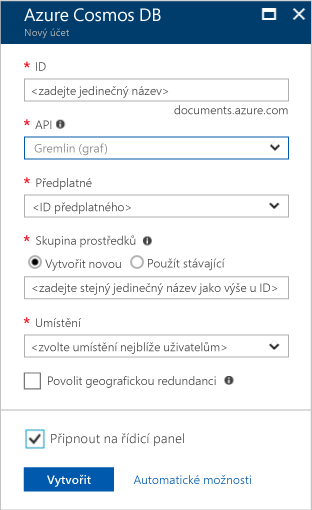

1. V novém okně přihlásit toohello [portál Azure](https://portal.azure.com/).
2. V levém podokně hello, klikněte na **nový**, klikněte na tlačítko **databáze**a potom v části **Azure Cosmos DB**, klikněte na tlačítko **vytvořit**.
   
   

3. V hello **nový účet** okno, zadejte hello konfigurace, který chcete použít pro tento účet Azure Cosmos DB. 

    Ve službě Azure Cosmos DB můžete vybrat jeden ze čtyř programovacích modelů: Gremlin (graf), MongoDB, SQL (DocumentDB) a Tabulka (klíč-hodnota). Každý z nich aktuálně vyžaduje samostatný účet.
       
    V tomto článku úvodní jsme programu proti hello rozhraní Graph API, takže zvolte **Gremlin (grafu)** při vyplňování formuláře hello. Pokud máte data dokumentu z aplikace katalogu, data typu klíč/hodnota (tabulka) nebo data migrovaná z aplikace MongoDB, je dobré si uvědomit, že databáze Azure Cosmos může poskytnout vysoce dostupnou a globálně distribuovanou platformu databázové služby pro všechny důležité podnikové aplikace.

    Vyplňte pole hello na hello **nový účet** okno, pomocí informací o hello v hello následující snímek obrazovky jako vodítko – vaše hodnoty se liší od hodnoty hello hello snímku obrazovky.
 
    

    Nastavení|Navrhovaná hodnota|Popis
    ---|---|---
    ID|*Jedinečná hodnota*|Jedinečný název, který identifikuje tento účet Azure Cosmos DB. Protože *documents.azure.com* je připojením toohello ID ID zadejte toocreate váš identifikátor URI, použití a jedinečné, ale osobní. Hello ID musí obsahovat jenom malá písmena, číslice a znak hello pomlčku (-) a musí obsahovat od 3 too50 znaky.
    Rozhraní API|Gremlin (graf)|Jsme programu proti hello [rozhraní Graph API](../articles/cosmos-db/graph-introduction.md) dále v tomto článku.|
    Předplatné|*Vaše předplatné*|předplatné Azure, které chcete pro tento účet Azure Cosmos DB toouse Hello. 
    Skupina prostředků|*Hello stejnou hodnotu jako ID*|Hello nový název skupiny prostředků pro váš účet. Pro jednoduchost můžete použít hello stejný název jako vaše ID. 
    Umístění|*Hello oblast nejbližší tooyour uživatelů*|Hello zeměpisného umístění, ve které toohost účtu Azure Cosmos DB. Vyberte umístění hello nejbližší uživatelé tooyour toogive je hello nejrychlejší přístup k datům toohello.

4. Klikněte na tlačítko **vytvořit** toocreate hello účtu.
5. Na horním panelu nástrojů hello, klikněte na tlačítko hello **oznámení** ikonu  procesu nasazení toomonitor hello.

    

6.  Když okna oznámení hello označuje hello nasazení hello úspěšně, zavřít okno s upozorněním a otevřete hello nový účet z hello **všechny prostředky** dlaždici na řídicím panelu hello. 

    
