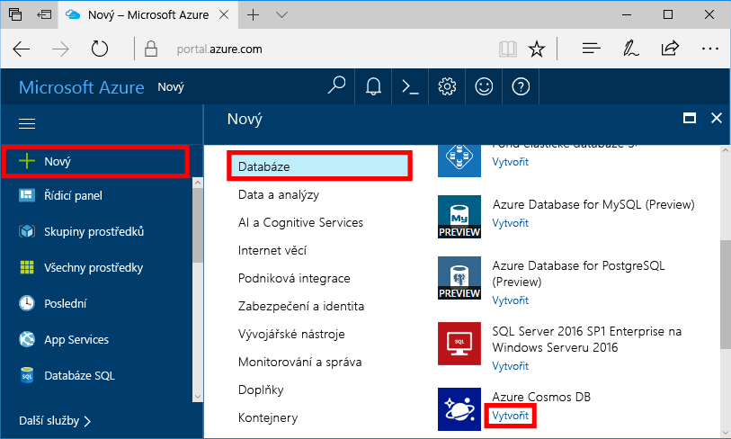
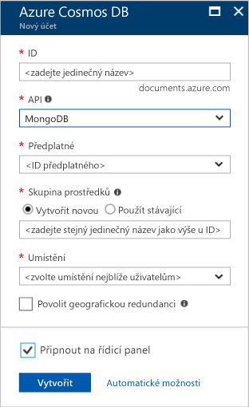
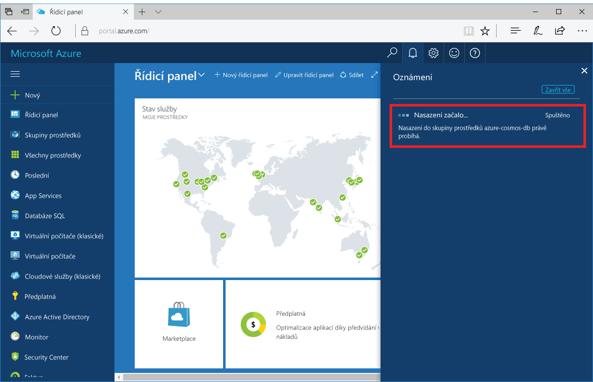
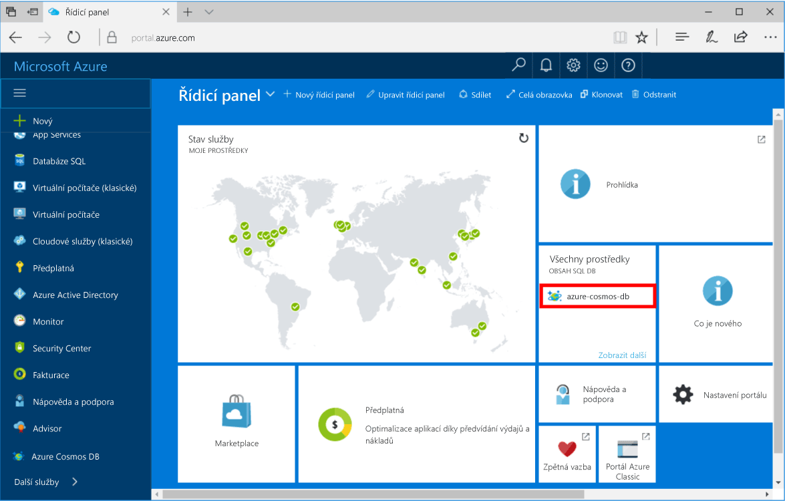

1. V novém okně přihlásit toohello [portál Azure](https://portal.azure.com/).In a new window, sign in toohello [Azure portal](https://portal.azure.com/).
2. V levé nabídce hello, klikněte na **nový**, klikněte na tlačítko **databáze**a potom v části **Azure Cosmos DB**, klikněte na tlačítko **vytvořit**.In hello left menu, click **New**, click **Databases**, and then under **Azure Cosmos DB**, click **Create**.
   
   

3. V hello **nový účet** okno, zadejte požadovanou konfiguraci hello hello účet Azure Cosmos DB.In hello **New account** blade, specify hello desired configuration for hello Azure Cosmos DB account. 

    V databázi Azure Cosmos můžete vybrat jeden ze čtyř programovacích modelů: Gremlin (graf), MongoDB, SQL (DocumentDB) a Tabulka (klíč-hodnota).With Azure Cosmos DB, you can choose one of four programming models: Gremlin (graph), MongoDB, SQL (DocumentDB), and Table (key-value). 
       
    V této úvodní jsme budete mít programové ošetření hello rozhraní API MongoDB, zvolíte **MongoDB** při vyplňování formuláře hello.In this quick start we'll be programming against hello MongoDB API so you'll choose **MongoDB** as you fill out hello form. Pokud ale máte data grafu pro aplikaci sociálních médií, data dokumentu z aplikace katalogu nebo data typu klíč/hodnota (tabulka), je dobré si uvědomit, že databáze Azure Cosmos může poskytnout vysoce dostupnou a globálně distribuovanou platformu databázové služby pro všechny důležité podnikové aplikace.But if you have graph data for a social media app, document data from a catalog app, or key/value (table) data, realize that Azure Cosmos DB can provide a highly available, globally-distributed database service platform for all your mission-critical applications.

    Vyplňte hello **nový účet** okno pomocí hello informace v tabulce hello jako vodítko.Fill out hello **New account** blade using hello information in hello table as a guide.
 
    
   
    NastaveníSetting|Navrhovaná hodnotaSuggested value|PopisDescription
    ---|---|---
    IDID|*Jedinečná hodnota**Unique value*|Jedinečný název zvolíte účet Azure Cosmos DB tooidentify hello.A unique name you choose tooidentify hello Azure Cosmos DB account. *Documents.Azure.com* je ID připojením toohello zadejte toocreate váš identifikátor URI, takže použijte jedinečné, ale osobní ID.*documents.azure.com* is appended toohello ID you provide toocreate your URI, so use a unique but identifiable ID. Hello ID může obsahovat jenom malá písmena, čísla a hello '-' znak a musí být v rozmezí 3 až 50 znaků.hello ID may contain only lowercase letters, numbers, and hello '-' character, and must be between 3 and 50 characters.
    Rozhraní APIAPI|MongoDBMongoDB|Jsme budete programování proti hello [MongoDB API](../articles/documentdb/documentdb-protocol-mongodb.md) dále v tomto článku.We'll be programming against hello [MongoDB API](../articles/documentdb/documentdb-protocol-mongodb.md) later in this article.|
    PředplatnéSubscription|*Vaše předplatné**Your subscription*|Hello předplatné Azure, že chcete toouse pro účet Azure Cosmos DB hello.hello Azure subscription that you want toouse for hello Azure Cosmos DB account. 
    Skupina prostředkůResource Group|*Hello stejnou hodnotu jako ID**hello same value as ID*|Hello nový název skupiny prostředků pro váš účet.hello new resource group name for your account. Pro jednoduchost můžete použít hello stejný název jako vaše ID.For simplicity, you can use hello same name as your ID. 
    UmístěníLocation|*Hello oblast nejbližší tooyour uživatelů**hello region closest tooyour users*|Hello zeměpisného umístění, ve které toohost účtu Azure Cosmos DB.hello geographic location in which toohost your Azure Cosmos DB account. Vyberte umístění hello nejbližší uživatelé tooyour toogive je hello nejrychlejší přístup k datům toohello.Choose hello location closest tooyour users toogive them hello fastest access toohello data.

4. Klikněte na tlačítko **vytvořit** toocreate hello účtu.Click **Create** toocreate hello account.
5. Na panelu nástrojů hello, klikněte na tlačítko **oznámení** procesu nasazení toomonitor hello.On hello toolbar, click **Notifications** toomonitor hello deployment process.

    

6.  Po dokončení nasazení hello otevřete hello nový účet z hello všechny prostředky dlaždici.When hello deployment is complete, open hello new account from hello All Resources tile. 

    
