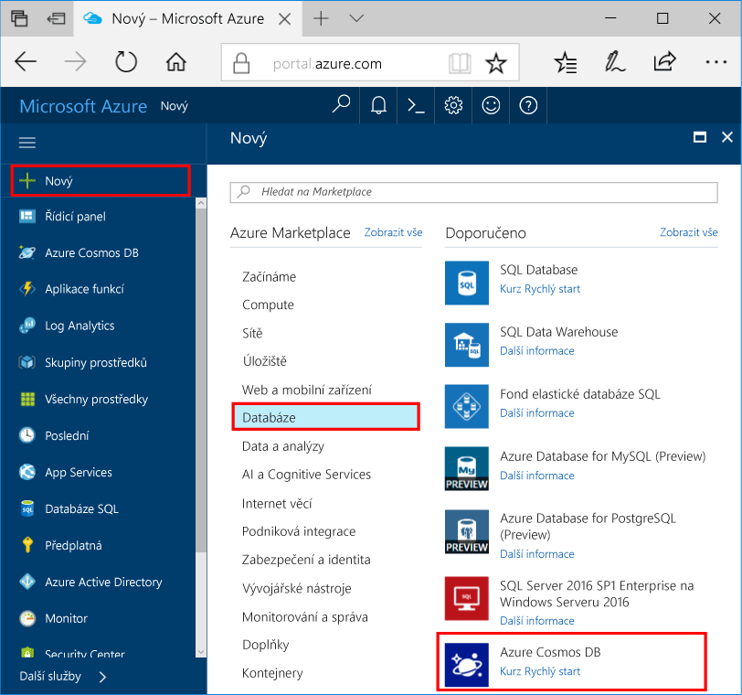

1. V novém okně přihlásit toohello [portál Azure](https://portal.azure.com/).In a new window, sign in toohello [Azure portal](https://portal.azure.com/).
2. V levém podokně hello, klikněte na **nový**, klikněte na tlačítko **databáze**a potom v části **Azure Cosmos DB**, klikněte na tlačítko **vytvořit**.In hello left pane, click **New**, click **Databases**, and then under **Azure Cosmos DB**, click **Create**.
   
   

3. Na hello **nový účet** okno, zadejte hello konfigurace, který chcete použít pro tento účet Azure Cosmos DB.On hello **New account** blade, specify hello configuration that you want for this Azure Cosmos DB account. 

    Ve službě Azure Cosmos DB můžete vybrat jeden ze čtyř programovacích modelů: Gremlin (graf), MongoDB, SQL (DocumentDB) a Tabulka (klíč-hodnota). Každý z nich aktuálně vyžaduje samostatný účet.With Azure Cosmos DB, you can choose one of four programming models: Gremlin (graph), MongoDB, SQL (DocumentDB), and Table (key-value), each which currently require a separate account.
    
    V tomto článku úvodní, jsme programu proti hello DocumentDB rozhraní API, takže zvolte **SQL (DocumentDB)** při vyplňování formuláře hello.In this quick-start article we program against hello DocumentDB API, so choose **SQL (DocumentDB)** as you fill out hello form. Pokud máte data grafu pro aplikaci sociálních médií, data typu klíč/hodnota (tabulka) nebo data migrovaná z aplikace MongoDB, je dobré si uvědomit, že služba Azure Cosmos DB může poskytnout vysoce dostupnou a globálně distribuovanou platformu databázové služby pro všechny důležité podnikové aplikace.If you have graph data for a social media app, or key/value (table) data, or data migrated from a MongoDB app, realize that Azure Cosmos DB can provide a highly available, globally distributed database service platform for all your mission-critical applications.

    Vyplňte pole hello na hello **nový účet** okno, pomocí informací o hello v hello následující snímek obrazovky jako průvodce – vaše hodnoty se liší od hodnoty hello hello snímku obrazovky.Complete hello fields on hello **New account** blade, using hello information in hello following screenshot as a guide- your values may be different than hello values in hello screenshot.
 
    

    NastaveníSetting|Navrhovaná hodnotaSuggested value|PopisDescription
    ---|---|---
    IDID|*Jedinečná hodnota**Unique value*|Jedinečný název, který identifikuje tento účet Azure Cosmos DB.A unique name that identifies this Azure Cosmos DB account. Protože *documents.azure.com* je připojením toohello ID ID zadejte toocreate váš identifikátor URI, použití a jedinečné, ale osobní.Because *documents.azure.com* is appended toohello ID that you provide toocreate your URI, use a unique but identifiable ID. Hello ID může obsahovat jenom malá písmena, číslice a znak hello pomlčku (-) a musí obsahovat 3 znaky too50.hello ID can contain only lowercase letters, numbers, and hello hyphen (-) character, and it must contain 3 too50 characters.
    Rozhraní APIAPI|SQL (DocumentDB)SQL (DocumentDB)|Jsme programu proti hello [DocumentDB API](../articles/documentdb/documentdb-introduction.md) dále v tomto článku.We program against hello [DocumentDB API](../articles/documentdb/documentdb-introduction.md) later in this article.|
    PředplatnéSubscription|*Vaše předplatné**Your subscription*|předplatné Azure, které chcete pro tento účet Azure Cosmos DB toouse Hello.hello Azure subscription that you want toouse for this Azure Cosmos DB account. 
    Skupina prostředkůResource Group|*Hello stejnou hodnotu jako ID**hello same value as ID*|Hello nový název skupiny prostředků pro váš účet.hello new resource-group name for your account. Pro jednoduchost můžete použít hello stejný název jako vaše ID.For simplicity, you can use hello same name as your ID. 
    UmístěníLocation|*Hello oblast nejbližší tooyour uživatelů**hello region closest tooyour users*|Hello zeměpisného umístění, ve které toohost účtu Azure Cosmos DB.hello geographic location in which toohost your Azure Cosmos DB account. Vyberte hello umístění, které je nejblíže uživatele toogive tooyour je hello nejrychlejší přístup k datům toohello.Choose hello location that's closest tooyour users toogive them hello fastest access toohello data.
4. Klikněte na tlačítko **vytvořit** toocreate hello účtu.Click **Create** toocreate hello account.
5. Na horním panelu nástrojů hello, klikněte na tlačítko hello **oznámení** ikonu  procesu nasazení toomonitor hello.On hello top toolbar, click hello **Notifications** icon  toomonitor hello deployment process.

    

6.  Když okna oznámení hello označuje hello nasazení hello úspěšně, zavřít okno s upozorněním a otevřete hello nový účet z hello **všechny prostředky** dlaždici na řídicím panelu hello.When hello Notifications window indicates hello deployment succeeded, close hello notification window and open hello new account from hello **All Resources** tile on hello Dashboard. 

    
 
