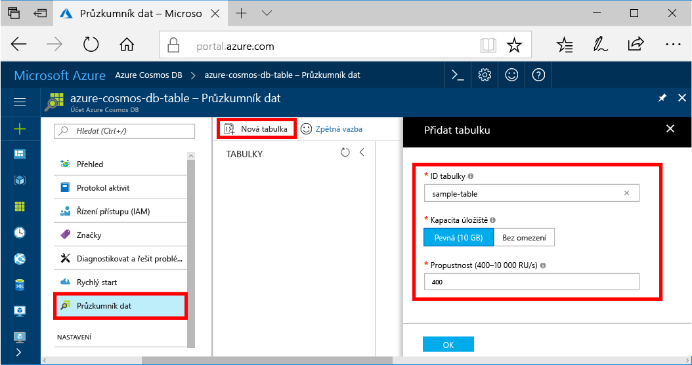

Teď můžete pomocí Průzkumníku dat toocreate tabulku a přidat data tooyour databáze. 

1. V hello portál Azure, v navigační nabídce hello, klikněte na **Data Explorer (Preview)**. 
2. V okně hello Průzkumníku dat, klikněte na tlačítko **novou tabulku**, potom vyplňte stránku hello pomocí hello následující informace.

    

    Nastavení|Navrhovaná hodnota|Popis
    ---|---|---
    ID tabulky|sample-table|Hello ID pro novou tabulku. Názvy tabulek mít hello znak stejné požadavky jako ID databáze. Názvy databází musí mít délku 1 až 255 znaků a nesmí obsahovat znaky `/ \ # ?` ani koncové mezery.
    Kapacita úložiště| 10 GB|Ponechte výchozí hodnotu hello. Toto je kapacita úložiště hello hello databáze.
    Propustnost|400 RU/s|Ponechte výchozí hodnotu hello. Můžete postupně škálovat hello [propustnost](../articles/cosmos-db/request-units.md) novější, pokud chcete, aby tooreduce latence.

3. Jakmile vyplňování formuláře hello, klikněte na možnost **OK**.
