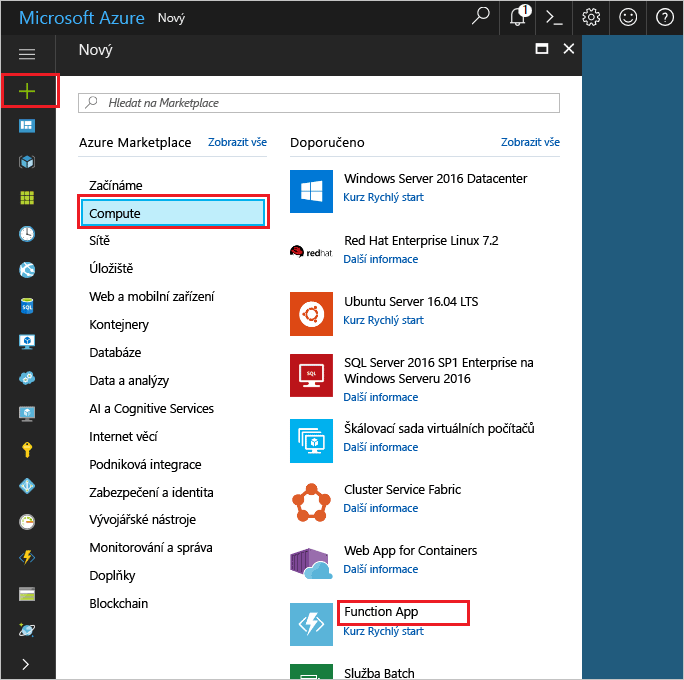

1. Klikněte na tlačítko hello **nový** nalezeno tlačítko na hello levém horním rohu hello portálu Azure.Click hello **New** button found on hello upper left-hand corner of hello Azure portal.

1. Klikněte na **Vypočítat** > **Function App** a vyberte svoje **Předplatné**.Click **Compute** > **Function App**, select your **Subscription**. Potom použijte nastavení aplikace hello funkce jako tabulka hello.Then, use hello function app settings as specified in hello table.

    

    | NastaveníSetting      | Navrhovaná hodnotaSuggested value  | PopisDescription                                        |
    | ------------ |  ------- | -------------------------------------------------- |
    | **Název aplikace****App name** | Globálně jedinečný názevGlobally unique name | Název identifikující novou aplikaci Function App.Name that identifies your new function app. | 
    | **[Skupina prostředků](../articles/azure-resource-manager/resource-group-overview.md)****[Resource Group](../articles/azure-resource-manager/resource-group-overview.md)** |  myResourceGroupmyResourceGroup | Název pro novou skupinu prostředků hello v které toocreate funkce aplikace.Name for hello new resource group in which toocreate your function app. | 
    | **[Plán hostování](../articles/azure-functions/functions-scale.md)****[Hosting plan](../articles/azure-functions/functions-scale.md)** |   Plán ConsumptionConsumption plan | Hostování plán, který definuje, jak prostředky se přidělují tooyour funkce aplikace.Hosting plan that defines how resources are allocated tooyour function app. Ve výchozím nastavení hello **plánování spotřeba**, prostředky se přidají dynamicky podle požadavků vaší funkce.In hello default **Consumption Plan**, resources are added dynamically as required by your functions. Platíte jenom dobu hello spuštění funkcí.You only pay for hello time your functions run.   |
    | **Umístění****Location** | Západní EvropaWest Europe | Vyberte umístění ve vaší blízkosti nebo v blízkosti jiných služeb, ke kterým budou funkce získávat přístup.Choose a location near you or near other services your functions will access. |
    | **[Účet úložiště](../articles/storage/common/storage-create-storage-account.md#create-a-storage-account)****[Storage account](../articles/storage/common/storage-create-storage-account.md#create-a-storage-account)** |  Globálně jedinečný názevGlobally unique name |  Název nového účtu úložiště hello používá funkce aplikace.Name of hello new storage account used by your function app. Názvy účtů úložiště musí mít od 3 do 24 znaků a můžou obsahovat jenom číslice a malá písmena.Storage account names must be between 3 and 24 characters in length and may contain numbers and lowercase letters only. Můžete taky použít existující účet.You can also use an existing account. |

1. Klikněte na tlačítko **vytvořit** tooprovision a nasaďte novou aplikaci funkce hello.Click **Create** tooprovision and deploy hello new function app.
