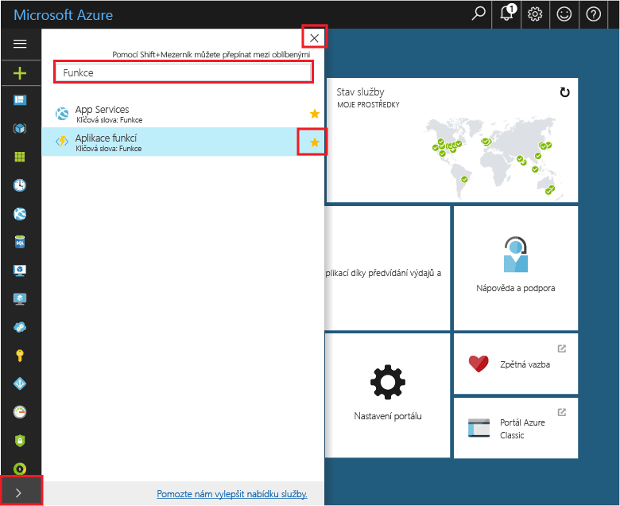
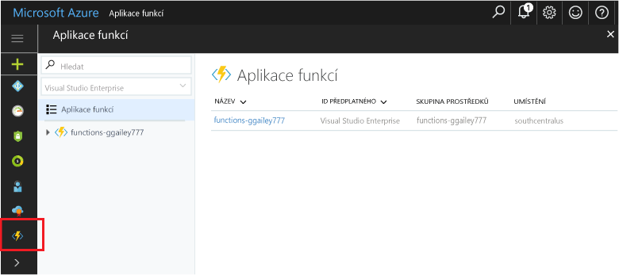

## Přidání funkce aplikace tooyour portálu Oblíbené 

Pokud jste tak již neučinili, přidejte Oblíbené tooyour funkce aplikace v hello portálu Azure. Díky tomu je snazší toofind funkce aplikací. Pokud jste to již provedli, toohello další část přeskočte. 

1. Přihlaste se toohello [portál Azure](https://portal.azure.com/).

2. Klikněte na šipku hello v levém tooexpand dolní hello všechny služby, typ `Functions` v hello **filtru** pole a potom klikněte na hvězdičky hello vedle příliš**funkce aplikace**.  
 
    

    Tento postup přidá hello funkce ikonu toohello nabídky na levé straně hello hello portálu.

3. Zavřete hello nabídce a potom přejděte dolů toohello dolní toosee hello funkce ikonu. Kliknutím na tuto ikonu toosee seznam všechny funkce aplikace. Klikněte na tlačítko vaší aplikace toowork funkce s funkcí v této aplikaci. 
 
    
 
     