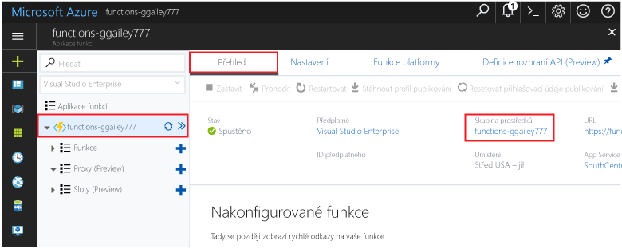

Další rychlé starty v této kolekci jsou postavené na tomto rychlém startu. Pokud máte v plánu toocontinue na toowork několik rychlé spuštění nebo s hello kurzy, vyčistěte hello prostředky vytvořené v této rychlé nespouštějte. 

Pokud neplánujete toocontinue, klikněte na tlačítko hello **skupiny prostředků** pro funkce aplikace hello hello portálu, a pak klikněte na **odstranit**. 

