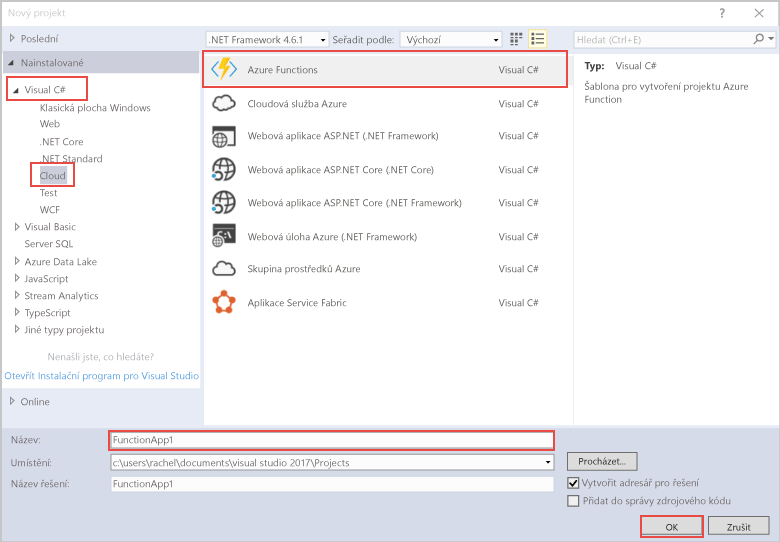

Šablona projektu Azure Functions v sadě Visual Studio vytvoří projekt, který jde publikovat do aplikace funkcí v Azure.The Azure Functions project template in Visual Studio creates a project that can be published to a function app in Azure. Aplikace Function App umožňuje seskupit funkce jako logickou jednotku pro snadnější správu, nasazování a sdílení prostředků.A function app lets you group functions as a logic unit for easier management, deployment, and sharing of resources.   

1. V **Průzkumníku řešení** klikněte pravým tlačítkem na uzel projektu a pak zvolte **Přidat** > **Nová položka**.Right mouse click on the project node in **Solution Explorer**, then choose **Add** > **New Item**. V dialogovém okně zvolte **Funkce Azure**.Choose **Azure Function** from the dialog box.

2. V dialogovém okně **Nový projekt** rozbalte uzel **Visual C#** > **Cloud**, vyberte **Azure Functions**, zadejte **název** vašeho projektu a klikněte na **OK**.In the **New Project** dialog, expand **Visual C#** > **Cloud** node, select **Azure Functions**, type a **Name** for your project, and click **OK**. Název aplikace funkcí musí být platný jako obor názvů C#, takže nepoužívejte podtržítka, pomlčky nebo jiné nealfanumerické znaky.The function app name must be valid as a C# namespace, so don't use underscores, hyphens, or any other nonalphanumeric characters. 

    