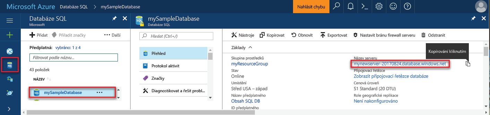

## Přihlaste se toohello portálu AzureLog in toohello Azure portal

Přihlaste se toohello [portál Azure](https://portal.azure.com/).Log in toohello [Azure portal](https://portal.azure.com/).

## Vytvořit prázdnou databázi SQL pomocí hello portálu AzureCreate a blank SQL database using hello Azure portal

Databáze SQL Azure se vytvoří s definovanou sadou [výpočetních prostředků a prostředků úložiště](../articles/sql-database/sql-database-service-tiers.md).An Azure SQL database is created with a defined set of [compute and storage resources](../articles/sql-database/sql-database-service-tiers.md). Hello databáze byla vytvořena v rámci [skupina prostředků Azure](../articles/azure-resource-manager/resource-group-overview.md) a v [logického serveru Azure SQL Database](../articles/sql-database/sql-database-features.md).hello database is created within an [Azure resource group](../articles/azure-resource-manager/resource-group-overview.md) and in an [Azure SQL Database logical server](../articles/sql-database/sql-database-features.md). 

Postupujte podle těchto kroků toocreate prázdnou databázi SQL.Follow these steps toocreate a blank SQL database. 

1. Klikněte na tlačítko hello **nový** nalezeno tlačítko na hello levém horním rohu hello portálu Azure.Click hello **New** button found on hello upper left-hand corner of hello Azure portal.

2. Vyberte **databáze** z hello **nový** a vyberte **SQL Database** z hello **databáze** stránky.Select **Databases** from hello **New** page, and select **SQL Database** from hello **Databases** page. 

   

3. Vyplňte hello SQL Database formulář s hello následující informace, jak je znázorněno na hello předcházející bitové kopie:Fill out hello SQL Database form with hello following information, as shown on hello preceding image:   

   | NastaveníSetting | Navrhovaná hodnotaSuggested value | PopisDescription |
   | --------| --------------- | ----------- | 
   | **Název databáze****Database name** | mySampleDatabasemySampleDatabase | Platné názvy databází najdete v tématu [Identifikátory databází](https://docs.microsoft.com/sql/relational-databases/databases/database-identifiers).For valid database names, see [Database Identifiers](https://docs.microsoft.com/sql/relational-databases/databases/database-identifiers). | 
   | **Předplatné****Subscription** | Vaše předplatnéYour subscription  | Podrobnosti o vašich předplatných najdete v tématu [Předplatná](https://account.windowsazure.com/Subscriptions).For details about your subscriptions, see [Subscriptions](https://account.windowsazure.com/Subscriptions). |
   | **Skupina prostředků****Resource group** | myResourceGroupmyResourceGroup | Platné názvy skupin prostředků najdete v tématu [Pravidla a omezení pojmenování](https://docs.microsoft.com/azure/architecture/best-practices/naming-conventions).For valid resource group names, see [Naming rules and restrictions](https://docs.microsoft.com/azure/architecture/best-practices/naming-conventions). |
   | **Vyberte zdroj****Select source** | Prázdnou databáziBlank database | Určuje, že by měl být vytvořen prázdnou databázi.Specifies that a blank database should be created. |
   ||||

4. Klikněte na tlačítko **Server** toocreate a nakonfigurujte nový server pro novou databázi.Click **Server** toocreate and configure a new server for your new database. Vyplňte hello **nového formuláře serveru** s hello následující informace:Fill out hello **New server form** with hello following information: 

   | NastaveníSetting | Navrhovaná hodnotaSuggested value | PopisDescription |
   | --------| --------------- | ----------- | 
   | **Název serveru****Server name** | Libovolný globálně jedinečný název.Any globally unique name. | Platné názvy serverů najdete v tématu [Pravidla a omezení pojmenování](https://docs.microsoft.com/azure/architecture/best-practices/naming-conventions).For valid server names, see [Naming rules and restrictions](https://docs.microsoft.com/azure/architecture/best-practices/naming-conventions). | 
   | **Přihlašovací jméno správce serveru****Server admin login** | Libovolný platný název.Any valid name. | Platná přihlašovací jména najdete v tématu [Identifikátory databází](https://docs.microsoft.com/sql/relational-databases/databases/database-identifiers).For valid login names, see [Database Identifiers](https://docs.microsoft.com/sql/relational-databases/databases/database-identifiers).|
   | **Heslo****Password** | Všechny platné heslo.Any valid password. | Heslo musí mít aspoň osm znaků a musí obsahovat znaky ze tří z následujících kategorií hello: velká písmena, malá písmena, číslice a jiné než alfanumerické znaky.Your password must have at least eight characters and must contain characters from three of hello following categories: upper case characters, lower case characters, numbers, and non-alphanumeric characters. |
   | **Umístění****Location** | Jakékoli platné umístění.Any valid location. | Informace o oblastech najdete v tématu [Oblasti služeb Azure](https://azure.microsoft.com/regions/).For information about regions, see [Azure Regions](https://azure.microsoft.com/regions/). |
   ||||

   

5. Klikněte na **Vybrat**.Click **Select**.

6. Klikněte na tlačítko **cenová úroveň** toospecify hello služby vrstvy a úroveň výkonu pro novou databázi.Click **Pricing tier** toospecify hello service tier and performance level for your new database. V tomto kurzu vyberte **20 Dtu** a **250** GB úložiště.For this tutorial, select **20 DTUs** and **250** GB of storage.

   

7. Klikněte na tlačítko **Použít**.Click **Apply**.  

8. Vyberte **kolace** pro prázdnou databázi hello (pro tento kurz použijte hello výchozí hodnota).Select a **collation** for hello blank database (for this tutorial, use hello default value). Další informace o kolacích najdete v tématu [kolace](https://docs.microsoft.com/sql/t-sql/statements/collations)For more information about collations, see [Collations](https://docs.microsoft.com/sql/t-sql/statements/collations)

9. Klikněte na tlačítko **vytvořit** tooprovision hello databáze.Click **Create** tooprovision hello database. Zřizování trvá o minutu a půl toocomplete.Provisioning takes about a minute and a half toocomplete. 

10. Na panelu nástrojů hello, klikněte na tlačítko **oznámení** procesu nasazení toomonitor hello.On hello toolbar, click **Notifications** toomonitor hello deployment process.

   

## Vytvoření pravidla brány firewall na úrovni serveru pomocí hello portálu AzureCreate a server-level firewall rule using hello Azure portal

Hello služba SQL Database vytvoří brána firewall na úrovni serveru hello.hello SQL Database service creates a firewall at hello server-level. Původně hello brána firewall brání externích nástrojů a aplikací z připojení serveru toohello nebo tooany databáze na serveru hello.Initially hello firewall prevents external tools and applications from connecting toohello server, or tooany databases on hello server. Připojení jsou povoleny po vytvoření pravidla brány firewall tooopen konkrétní IP adresy.Connections are allowed after a firewall rule is created tooopen specific IP addresses. Postupujte podle těchto kroků toocreate [pravidlo brány firewall na úrovni serveru SQL Database](../articles/sql-database/sql-database-firewall-configure.md) pro IP adresu vašeho klienta a tooenable externí připojení přes firewall hello databáze SQL pro vaše IP adresa.Follow these steps toocreate a [SQL Database server-level firewall rule](../articles/sql-database/sql-database-firewall-configure.md) for your client's IP address, and tooenable external connectivity through hello SQL Database firewall for your IP address only. 

> [!NOTE]
> Azure SQL Database komunikuje přes port 1433.Azure SQL Database communicates over port 1433. TooSQL databáze můžete připojit až po hello brána firewall vaší sítě umožňuje odchozí provoz přes port 1433.You can connect tooSQL Database only after hello firewall of your network allows outbound traffic through port 1433.

1. Po dokončení hello nasazení, klikněte na tlačítko **databází SQL** z nabídky na levé straně hello a pak klikněte na tlačítko **mySampleDatabase** na hello **databází SQL** stránky.After hello deployment completes, click **SQL databases** from hello left-hand menu and then click **mySampleDatabase** on hello **SQL databases** page. Hello přehledová stránka otevře vaší databáze, zobrazující text hello plně kvalifikovaný název serveru (například **mynewserver20170313.database.windows.net**) a poskytuje možnosti pro další konfiguraci.hello overview page for your database opens, showing you hello fully qualified server name (such as **mynewserver20170313.database.windows.net**) and provides options for further configuration. Tento plně kvalifikovaný název serveru zkopírujte pro pozdější použití.Copy this fully qualified server name for use later.

   > [!IMPORTANT]
   > Je nutné tento plně kvalifikovaný název tooconnect tooyour serveru a její databáze v následných rychlé zahájení.You need this fully qualified server name tooconnect tooyour server and its databases in subsequent quick starts.
   > 

    

2. Klikněte na tlačítko **nastavení brány firewall serveru** na panelu nástrojů hello viz předchozí obrázek hello.Click **Set server firewall** on hello toolbar as shown in hello previous image. Hello **nastavení brány Firewall** otevře se stránka pro hello databáze SQL server.hello **Firewall settings** page for hello SQL Database server opens. 

    

3. Klikněte na tlačítko **přidat IP adresu klienta** na panelu nástrojů tooadd hello vaše aktuální IP adres tooa nové pravidlo brány firewall.Click **Add client IP** on hello toolbar tooadd your current IP address tooa new firewall rule. Pravidlo brány firewall může otevřít port 1433 pro jednu IP adresu nebo rozsah IP adres.A firewall rule can open port 1433 for a single IP address or a range of IP addresses.

4. Klikněte na **Uložit**.Click **Save**. Pro aktuální IP adrese otevřít port 1433 na logickém serveru hello je vytvořeno pravidlo brány firewall na úrovni serveru.A server-level firewall rule is created for your current IP address opening port 1433 on hello logical server.

    

4. Klikněte na tlačítko **OK** a pak zavřete hello **nastavení brány Firewall** stránky.Click **OK** and then close hello **Firewall settings** page.

Toohello serveru Azure SQL Database a její databáze je nyní můžete připojit pomocí nástroje, jako je například SQL Server Management Studio (SSMS).You can now connect toohello Azure SQL Database server and its databases by using a tool such as SQL Server Management Studio (SSMS). Hello připojení z tuto IP adresu, a bude používat účet správce serveru hello předtím vytvořili.hello connection is from this IP address, and it uses hello server admin account created previously.

> [!IMPORTANT]
> Standardně je povolen přístup přes bránu firewall hello databáze SQL pro všechny služby Azure.By default, access through hello SQL Database firewall is enabled for all Azure services. Klikněte na tlačítko **OFF** na této stránce toodisable pro všechny služby Azure.Click **OFF** on this page toodisable for all Azure services.

## Získat hodnoty připojovacího řetězce pomocí hello portálu AzureGet connection string values using hello Azure portal

Získáte hello serveru plně kvalifikovaný název pro váš server Azure SQL Database v hello portálu Azure.Get hello fully qualified server name for your Azure SQL Database server in hello Azure portal. Použijete hello plně kvalifikovaný název tooconnect tooyour serveru pomocí SQL Server Management Studio.You use hello fully qualified server name tooconnect tooyour server using SQL Server Management Studio.

1. Přihlaste se toohello [portál Azure](https://portal.azure.com/).Log in toohello [Azure portal](https://portal.azure.com/).

2. Vyberte **databází SQL** z nabídky na levé straně hello a klikněte na tlačítko databáze na hello **databází SQL** stránky.Select **SQL Databases** from hello left-hand menu, and click your database on hello **SQL databases** page. 

3. V hello **Essentials** podokně hello Azure stránky portálu pro vaši databázi, vyhledejte a pak zkopírujte hello **název serveru**.In hello **Essentials** pane in hello Azure portal page for your database, locate and then copy hello **Server name**.

    
