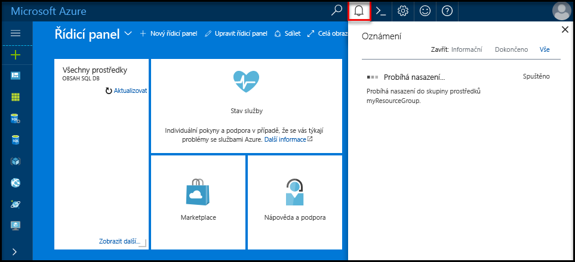

## Přihlaste se toohello portálu Azure

Přihlaste se toohello [portál Azure](https://portal.azure.com/).

## Vytvořit prázdnou databázi SQL pomocí hello portálu Azure

Databáze SQL Azure se vytvoří s definovanou sadou [výpočetních prostředků a prostředků úložiště](../articles/sql-database/sql-database-service-tiers.md). Hello databáze byla vytvořena v rámci [skupina prostředků Azure](../articles/azure-resource-manager/resource-group-overview.md) a v [logického serveru Azure SQL Database](../articles/sql-database/sql-database-features.md). 

Postupujte podle těchto kroků toocreate prázdnou databázi SQL. 

1. Klikněte na tlačítko hello **nový** nalezeno tlačítko na hello levém horním rohu hello portálu Azure.

2. Vyberte **databáze** z hello **nový** a vyberte **SQL Database** z hello **databáze** stránky. 

   

3. Vyplňte hello SQL Database formulář s hello následující informace, jak je znázorněno na hello předcházející bitové kopie:   

   | Nastavení | Navrhovaná hodnota | Popis |
   | --------| --------------- | ----------- | 
   | **Název databáze** | mySampleDatabase | Platné názvy databází najdete v tématu [Identifikátory databází](https://docs.microsoft.com/sql/relational-databases/databases/database-identifiers). | 
   | **Předplatné** | Vaše předplatné  | Podrobnosti o vašich předplatných najdete v tématu [Předplatná](https://account.windowsazure.com/Subscriptions). |
   | **Skupina prostředků** | myResourceGroup | Platné názvy skupin prostředků najdete v tématu [Pravidla a omezení pojmenování](https://docs.microsoft.com/azure/architecture/best-practices/naming-conventions). |
   | **Vyberte zdroj** | Prázdnou databázi | Určuje, že by měl být vytvořen prázdnou databázi. |
   ||||

4. Klikněte na tlačítko **Server** toocreate a nakonfigurujte nový server pro novou databázi. Vyplňte hello **nového formuláře serveru** s hello následující informace: 

   | Nastavení | Navrhovaná hodnota | Popis |
   | --------| --------------- | ----------- | 
   | **Název serveru** | Libovolný globálně jedinečný název. | Platné názvy serverů najdete v tématu [Pravidla a omezení pojmenování](https://docs.microsoft.com/azure/architecture/best-practices/naming-conventions). | 
   | **Přihlašovací jméno správce serveru** | Libovolný platný název. | Platná přihlašovací jména najdete v tématu [Identifikátory databází](https://docs.microsoft.com/sql/relational-databases/databases/database-identifiers).|
   | **Heslo** | Všechny platné heslo. | Heslo musí mít aspoň osm znaků a musí obsahovat znaky ze tří z následujících kategorií hello: velká písmena, malá písmena, číslice a jiné než alfanumerické znaky. |
   | **Umístění** | Jakékoli platné umístění. | Informace o oblastech najdete v tématu [Oblasti služeb Azure](https://azure.microsoft.com/regions/). |
   ||||

   

5. Klikněte na **Vybrat**.

6. Klikněte na tlačítko **cenová úroveň** toospecify hello služby vrstvy a úroveň výkonu pro novou databázi. V tomto kurzu vyberte **20 Dtu** a **250** GB úložiště.

   

7. Klikněte na tlačítko **Použít**.  

8. Vyberte **kolace** pro prázdnou databázi hello (pro tento kurz použijte hello výchozí hodnota). Další informace o kolacích najdete v tématu [kolace](https://docs.microsoft.com/sql/t-sql/statements/collations)

9. Klikněte na tlačítko **vytvořit** tooprovision hello databáze. Zřizování trvá o minutu a půl toocomplete. 

10. Na panelu nástrojů hello, klikněte na tlačítko **oznámení** procesu nasazení toomonitor hello.

   

## Vytvoření pravidla brány firewall na úrovni serveru pomocí hello portálu Azure

Hello služba SQL Database vytvoří brána firewall na úrovni serveru hello. Původně hello brána firewall brání externích nástrojů a aplikací z připojení serveru toohello nebo tooany databáze na serveru hello. Připojení jsou povoleny po vytvoření pravidla brány firewall tooopen konkrétní IP adresy. Postupujte podle těchto kroků toocreate [pravidlo brány firewall na úrovni serveru SQL Database](../articles/sql-database/sql-database-firewall-configure.md) pro IP adresu vašeho klienta a tooenable externí připojení přes firewall hello databáze SQL pro vaše IP adresa. 

> [!NOTE]
> Azure SQL Database komunikuje přes port 1433. TooSQL databáze můžete připojit až po hello brána firewall vaší sítě umožňuje odchozí provoz přes port 1433.

1. Po dokončení hello nasazení, klikněte na tlačítko **databází SQL** z nabídky na levé straně hello a pak klikněte na tlačítko **mySampleDatabase** na hello **databází SQL** stránky. Hello přehledová stránka otevře vaší databáze, zobrazující text hello plně kvalifikovaný název serveru (například **mynewserver20170313.database.windows.net**) a poskytuje možnosti pro další konfiguraci. Tento plně kvalifikovaný název serveru zkopírujte pro pozdější použití.

   > [!IMPORTANT]
   > Je nutné tento plně kvalifikovaný název tooconnect tooyour serveru a její databáze v následných rychlé zahájení.
   > 

    

2. Klikněte na tlačítko **nastavení brány firewall serveru** na panelu nástrojů hello viz předchozí obrázek hello. Hello **nastavení brány Firewall** otevře se stránka pro hello databáze SQL server. 

    

3. Klikněte na tlačítko **přidat IP adresu klienta** na panelu nástrojů tooadd hello vaše aktuální IP adres tooa nové pravidlo brány firewall. Pravidlo brány firewall může otevřít port 1433 pro jednu IP adresu nebo rozsah IP adres.

4. Klikněte na **Uložit**. Pro aktuální IP adrese otevřít port 1433 na logickém serveru hello je vytvořeno pravidlo brány firewall na úrovni serveru.

    

4. Klikněte na tlačítko **OK** a pak zavřete hello **nastavení brány Firewall** stránky.

Toohello serveru Azure SQL Database a její databáze je nyní můžete připojit pomocí nástroje, jako je například SQL Server Management Studio (SSMS). Hello připojení z tuto IP adresu, a bude používat účet správce serveru hello předtím vytvořili.

> [!IMPORTANT]
> Standardně je povolen přístup přes bránu firewall hello databáze SQL pro všechny služby Azure. Klikněte na tlačítko **OFF** na této stránce toodisable pro všechny služby Azure.

## Získat hodnoty připojovacího řetězce pomocí hello portálu Azure

Získáte hello serveru plně kvalifikovaný název pro váš server Azure SQL Database v hello portálu Azure. Použijete hello plně kvalifikovaný název tooconnect tooyour serveru pomocí SQL Server Management Studio.

1. Přihlaste se toohello [portál Azure](https://portal.azure.com/).

2. Vyberte **databází SQL** z nabídky na levé straně hello a klikněte na tlačítko databáze na hello **databází SQL** stránky. 

3. V hello **Essentials** podokně hello Azure stránky portálu pro vaši databázi, vyhledejte a pak zkopírujte hello **název serveru**.

    
